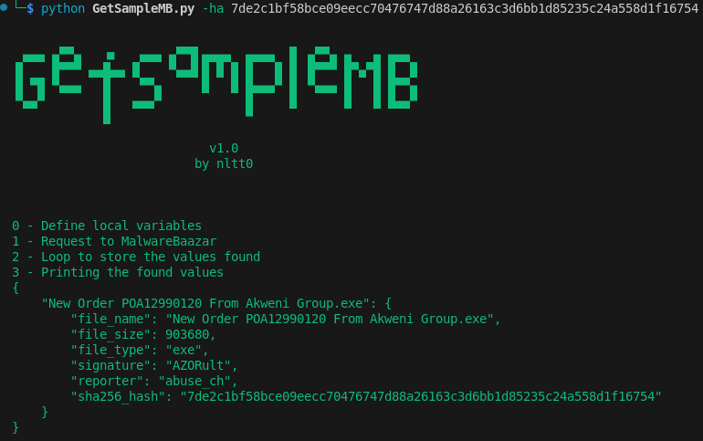

# GetSampleMB



## Usage

```
---

[0] - Create auth_key -> https://auth.abuse.ch/

[00] - Create file .env with variable in current directory 

[01] - Example file content:
AUTH='69d00b49efaffec4821af2e72039803b575d4c26c7e11b1e1f1dc59c6ee926cf'

[02] -
python -m venv .venv
source .venv/bin/activate
pip install -r requirements.txt
--------

usage: GetSampleMB.py [-h] [-t [TAG]] [-l LIMIT] [-f FILE_TYPE] [-ha HASH] [-o]

Search for samples and download malware https://bazaar.abuse.ch/

options:
  -h, --help            show this help message and exit
  -t [TAG], --tag [TAG]
                        If you enable the option, you can search by tag (example: TrickBot)
  -l LIMIT, --limit LIMIT
                        Number of search results, default two
  -f FILE_TYPE, --file_type FILE_TYPE
                        If you enable the option, you can search by file extension
  -ha HASH, --hash HASH
                        If you enable the option, you can search by file hash
  -o, --option          Enables downloading of the result in json format

```

## Example

### Search by tag, by default the last two most recent values
`python GetSampleMB.py -t TrickBot`

### Search by file extension, by default the last two most recent values
`python GetSampleMB.py -f exe`

### Search by hash, by default the last two most recent values
`python GetSampleMB.py -ha 7de2c1bf58bce09eecc70476747d88a26163c3d6bb1d85235c24a558d1f16754`

### Search by hash, by default the last two most recent values ​​and also prompts for sample download
`python GetSampleMB.py -ha 7de2c1bf58bce09eecc70476747d88a26163c3d6bb1d85235c24a558d1f16754 -d`


## Limitations 

```
Download limit on the file download API

MalwareBazaar runs on Google Cloud infrastructure. Sadly, network egress traffic from Google Cloud is extremely expensive. We therefore had to restrict the number of file downloads on our file download API to 2,000 per IP address/day. For bulk downloads we recommend you to use the hourly and daily file exports of MalwareBazaar served by our datalake:

    MalwareBazaar hourly malware batches (ZIP password: infected)
    MalwareBazaar daily malware batches (ZIP password: infected)

Should you have valid reasons to download more than 2,000 malware samples through the file download API per day, feel free to reach out to us using the Spamhaus Technology contact form:
https://www.spamhaus.com/#contact-form

https://bazaar.abuse.ch/faq/#api-limit

```
